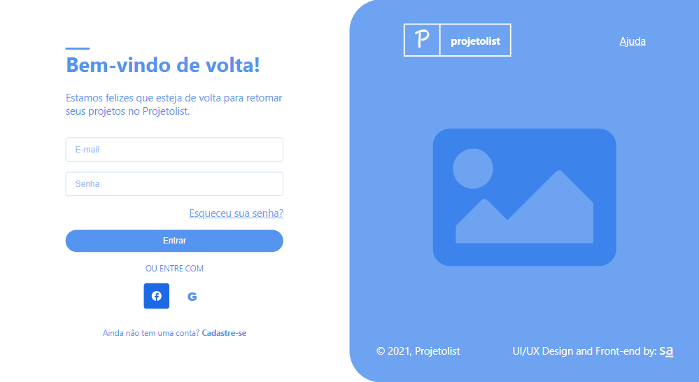

# Login interface

Este es un maquetado de login para una página utilizada en Brasil. 

Apretando [aquí](https://login-interface.vercel.app/), los redireccionara al deploy para poder visualizarla. Si desea probar su funcionamiento  
estos son los datos de prueba.  
E-mail: aguerofranco2002@gmail.com     
Senha: React2022 

 
El formulario de ingreso esta siendo controlado con la librería React Hook Form y las alertas con Sweet Alert2.

Si el usuario se loguea exitosamente, se guarda el token en el local storage.